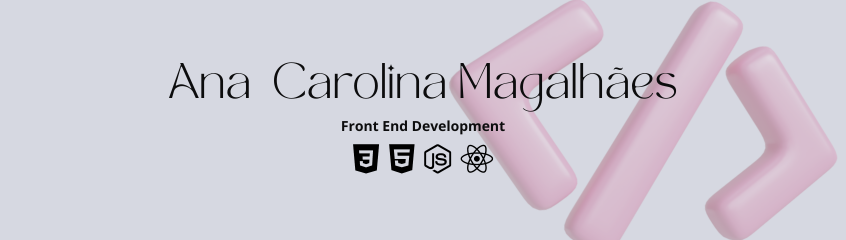

  

  <h2>About me</h2>
  
  

    <li>🌱 I'm currently learning more about React.
    <li>🎓 I'm studying a post graduation in Full Stack Web Development at <a href='https://www.pucminas.br/destaques/Paginas/default.aspx/'>PUC Minas</a>.</li>
    <li>🎓 I took a Web Development course at <a href='https://www.betrybe.com/'>Trybe</a>.</li>
    <li>💼 Bachelor of Arquitecture and Urbanism at <a href='https://www.faesa.br/'>Faesa Centro Universitário</a>.</li>
    <li>🌎 I live in Brazil and speak: Portuguese (Native), English (Intermediate and learning), French (Basic), Japanese (Learning).</li>
    <li>🤔 I'm chasing knowledge to evolve my developer career.</li>
    <li>🎮 My hobbies are playing video games, beach tennis, watching anime and kdrama.</li>
  

<h2>🤝 Connect with me</h2>

  
  &nbsp
  
  &nbsp
  

<h2>🛠 Tech Stack</h2>

  
  
  
  
  
  
  
  
  
  
  
  
  
  
  
  

  <h2>📈 My Github History</h2>
  

    
    &nbsp
    
  

  
   
  
   
  

